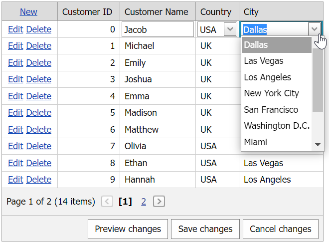

<!-- default badges list -->

[](https://supportcenter.devexpress.com/ticket/details/T356740)
[](https://docs.devexpress.com/GeneralInformation/403183)
<!-- default badges end -->
# Grid View for ASP.NET Web Forms - How to use WebMethods to implement cascading combo boxes in batch edit mode
<!-- run online -->
**[[Run Online]](https://codecentral.devexpress.com/128534636/)**
<!-- run online end -->

This example demonstrates how to implement cascading combo box editors in batch mode and use **WebMethods** to populate the editors with data. This example combines the following approaches:

* [Grid View for ASP.NET Web Forms - Cascading Combo Boxes in Batch Edit Mode](https://github.com/DevExpress-Examples/asp-net-web-forms-grid-cascading-comboboxes-in-batch-edit-mode)
* [Combo Box for ASP.NET Web Forms - How to use the WebMethod attribute to populate a cascading editor with data](https://github.com/DevExpress-Examples/how-to-populate-a-cascading-aspxcombobox-by-using-webmethods-t356687)



## Overview

The main idea is to use [WebMethods](https://learn.microsoft.com/en-us/previous-versions/visualstudio/visual-studio-2008/byxd99hx(v=vs.90)?redirectedfrom=MSDN) to update the secondary editor's data based on the primary editor's value.

```js
var lastCountryID;
var lastCityID;
function CountriesCombo_SelectedIndexChanged(s, e) {
    var currentCountryID = s.GetSelectedItem().value;
    lastCountryID = currentCountryID;
    lastCityID = -1;
    PageMethods.GetCities(lastCountryID, CitiesCombo_OnSuccessGetCities);
}
```

To enable this functionality, add the [ScriptManager](https://docs.devexpress.com/AspNet/DevExpress.Web.ASPxScriptManager) control to the page and set its [EnablePageMethods](https://learn.microsoft.com/en-us/dotnet/api/system.web.ui.scriptmanager.enablepagemethods?view=netframework-4.8.1) property to `true`.

```aspx
<asp:ScriptManager ID="ScriptManager1" runat="server" EnablePageMethods="true">
</asp:ScriptManager>
```

## Files to Review

* [Default.aspx](./CS/Default.aspx) (VB: [Default.aspx](./VB/Default.aspx))
* [Default.aspx.cs](./CS/Default.aspx.cs) (VB: [Default.aspx.vb](./VB/Default.aspx.vb))
* [JavaScript.js](./CS/JavaScript.js) (VB: [JavaScript.js](./VB/JavaScript.js))

## Documentation

* [Grid in Batch Edit Mode](https://docs.devexpress.com/AspNet/16443/components/grid-view/concepts/edit-data/batch-edit-mode)
* [GridViewDataComboBoxColumn](https://docs.devexpress.com/AspNet/DevExpress.Web.GridViewDataComboBoxColumn)
* [Script Manager](https://docs.devexpress.com/AspNet/DevExpress.Web.ASPxScriptManager)
